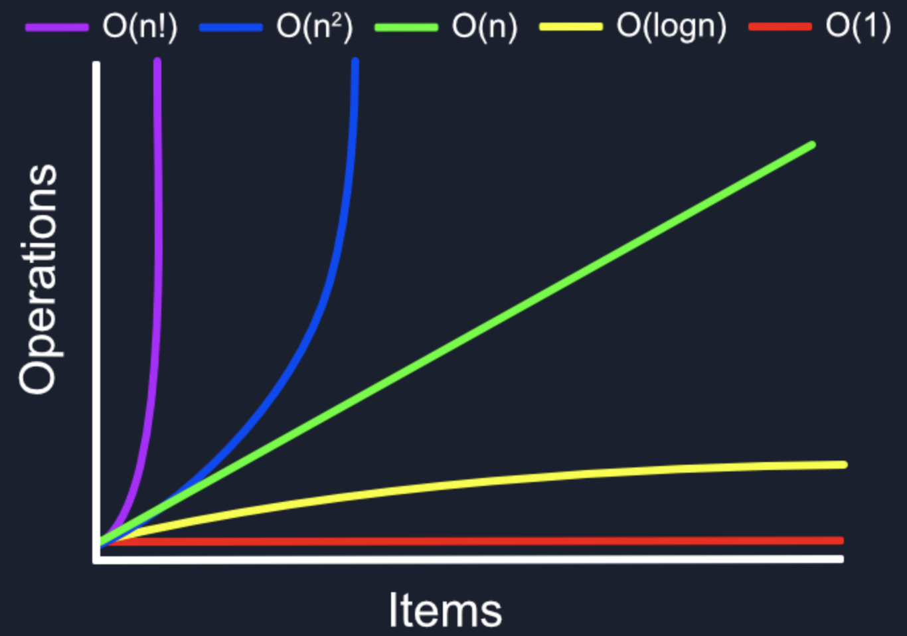

### What is Big O
It is a way to compare two sets of code to determine which one is "better" in terms of time complexity (the number of operations it takes to complete something) and the space complexity (how much memory it takes to complete that thing). 

`Time Complexity` is NOT measured in time but rather the number of operations it takes to complete something. 
`Space Complexity` is used to measure the memory space that your code takes. 

So when writing your algorithms you have to make the choice between time and space. Is the number of operations your code takes more important to you or how much memory it uses. 

### Big O Worst Case
Lets look at the following array: `[1,2,3,4,5,6,7]`. Our best case would be if we are looking for the value 1, average case would be if we are looking for the value 4, and our worst case would be if we are looking for the value 7. 

Remember `BIG O IS ALWAYS WORST CASE`. 

### O(n)
Lets look at the following code snippet to understand O(n). 
```Java 
public static void printItems(int n){
    for(int i = 0; i < n; i++){
        System.out.println(i);
    }
}

public static void main(String[] args){
    printItems(10);
}
```
This code will print out the values 0 through 9, 10 items in total.

The time complexity of this code is O(n) because we have done n number of operations where n is 10 in this case. 

### Drop Constants
When calculating the Big O of your algorithm, you can simplify things to determine the worst case complexity. 

In the previous example, we had the following code:
```Java 
public static void printItems(int n){
    for(int i = 0; i < n; i++){
        System.out.println(i);
    }
    for(int j = 0; j < n; j++){
        System.out.println(j);
    }
}
```
We have now added a second for loop that also prints the items n times. In this example, if we run the code with n being 10 again, the code will print out 0 through 0 twise. which will give use `n + n` whcih can be simplified to `2n`. You migt think this would be `O(2n)`. However, we can simplify this by dropping the constand which would leave us with `O(n)`. 

### O(n^2)
To have to the complexity of `O(n^2)` all we need to do is have one for loop run inside another for loop. like this:
```Java
public static void printItems(int n){
    for(int i = 0; i < n; i++){
        for(int j = 0; j < n; j++){
            System.out.println( i + " " + j);
       } 
    } 
}
```
Now these for loops ran `n*n = n^2` if n = 10, they will run 10*10 or 100 times. 

### Drop Non-Dominants
Lets examine the following code snippet:
```Java
public static void printItems(int n){
    //O(n^2)
    for(int i = 0; i < n; i++){
        for(int j = 0; j < n; j++){
            System.out.println( i + " " + j);
        } 
    }
    //O(n)
    for(int k = 0; k < n; k++){
        System.out.println(k);
    } 
}
```
Notice that we've added an extra for loop to our `O(n^2)` function to prints the items. Now this gives use `O(n^2 + n)`. However, we can drop the nom dominant `O(n)` as it would not be significant as the value of n get larger. Even if n was 100 n^2 would be 10000. There for the time complexity of this code would be: `O(n^2)` after dropping the non dominant complexity. 

### O(1)
Examine the following code:
```Java
public static int addItems(int n){
    return n + n;
}
```
Regardless of how large n is, this code will run only once which is the addition. Therefore, the time complexity is O(1) otherwise known as constant time. 

### O(log n)
Let's examine the following sorted array (the arrays must be sorted for this to work): 
`[1,2,3,4,5,6,7,8]`. Let's say we are looking for the value 1 in this array. We can divide the array into two half. `[1,2,3,4]` and `[5,6,7,8]`. Then we can ask, "is the value 1 in the first half or the second half?" Then we split the first half into 2, giving us `[1,2]` and `[3,4]`. Then we has the same question and divide the array into two half again giving us `[1]` and `[2]`. Finally we found the value we were looking for after three steps of dividing the array. Remember we had 8 elements on our original array. It just so happens that `2^3 = 8`. If we convert this equation into logarithm, it would look something like this: `log2 8 = 3`. Another way to understand this is if you took the value 8 and repeatedly divided it by 2, how many times would it take to get down to one item and that is 3 times. This technique is even more powerful as the size of the array grows. What if we had a billion items in the array, how many times would it take us to get down to one value remaining in the array? That would be 31 times. You can have an array with a billion items in it and find any item in that array in 31 steps. That is the power of `O(log n)`.

### Different Terms for Inputs
To understand this rule, let's look at the following code:
```Java
public static void printItems(int a, int b){
    for(int i = 0; i < a; i++){
        System.out.println(i);
    }
    for(int j = 0; j < b; j++){
        System.out.println(i);
    }
}
```
Since there are two different inputs in the printItems function, we cannot say that the big O is n + n or 2n. We have to to take in to account the different inputs and treat them separately when computing the big O. In this example the first for loop runs `O(a)` times and the second for loop runs `O(b)` times making the complexity `O(a + b)` and that is simplest we can get. 

### Big O Graph
